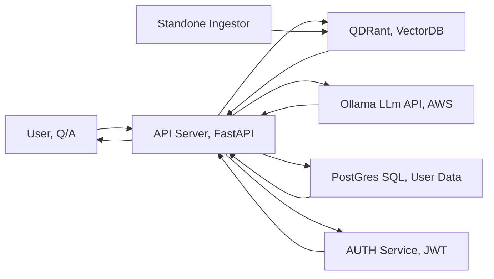

# erutalia
student project integrating LLM Ollama of AWS services on AWS EC2 or GCP

Architecture

## Docker commands

- Build overall from root dir all services up detached and contianerized
```docker compose up --build -d```

- Run in interactive mode without storing
```docker compose up --build```

- Stops and removes all containers + volumes (drops DB!)
```docker-compose down -v```

go to the directory /services/server
to build 
docker compose up --build postgres
to run 
docker compose up -d postgres

for building server
go to services/server
docker compose up --build server

note-for future use, use SQLalchemy2.X, in the requirments file for ingenstion 

# to run the ingestion process go to the folder services/extractor
python3.12 -m app.main process

## Process specific folder (override config)
python -m app.main process --input-dir /path/to/your/documents

## Process single file
python -m app.main process-file /path/to/specific/document.pdf

## Check for errors
python -m app.main show-errors

## Health check
python -m app.main health

## requirments initaial phase 
python -c "import nltk; nltk.download('punkt'); nltk.download('stopwords')"

Found 298 supported files
Supported formats: ['.pptx', '.pdf', '.png', '.docx', '.jpg', '.txt', '.jpeg']

degrading to CPU only 
pip3 uninstall -y sentence-transformers torch torchvision torchaudio

# better code for ingestion/embed.py
> If your embeddings are large and you don’t need to keep points in memory at all, you can even build and upload them on the fly instead of collecting all points first:

## Qdrant List all collections
```curl -X GET "http://localhost:6333/collections" | jq```

## Qdrant Get details of a specific collection
```curl -X GET "http://localhost:6333/collections/university_documents" | jq```
